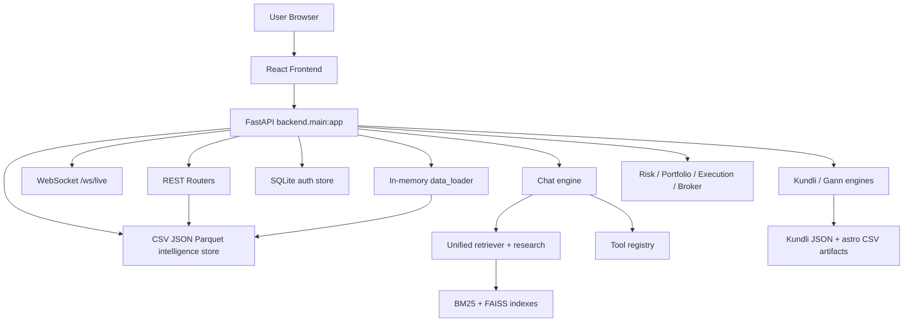

# VEDA-P000-02 Architecture

## Current architecture summary

The actual implementation is a **single FastAPI backend plus a single React frontend**, backed primarily by a **file-based data lake** under `data/`, with a **separate SQLite auth store** and **multiple engine families** for acquisition, intelligence, astrology, AI, RAG, ML, and orchestration.

The running application is broader than astrology. Astrology is one subsystem inside a market-intelligence platform.

## Primary runtime architecture



## Backend composition

### Main backend entry point

Authoritative backend server entry point:

- `backend/main.py`

Observed behaviour:

- constructs FastAPI app titled `Capital Flow Intelligence Platform`
- adds CORS for localhost frontend ports
- adds `AuthMiddleware`
- on startup:
  - `init_db()`
  - `bootstrap_admin()`
  - `data_loader.startup()`
  - `start_scheduler()`
  - `voice.validate_voices_on_startup()`

### Mounted router families

The running backend mounts these major router groups:

- market
- sectors
- stocks
- participant
- corporate
- chat
- data operations
- charts
- pipeline
- portfolio
- backtest
- broker
- research
- execution
- themes
- kundli
- news
- social pulse
- risk
- voice
- auth

## Frontend composition

### Frontend entry point

Authoritative frontend entry point:

- `frontend/src/main.tsx`

Observed behaviour:

- creates React root
- globally intercepts `fetch`
- automatically attaches bearer token from local storage
- redirects to `/login` on `401`

### Frontend shell

- `frontend/src/App.tsx`
- React Router + React Query
- `AppShell` wraps most routes
- `/fullchart/:symbol` is routed outside the normal shell

## Entry-point inventory

| Entry point | File | Role | Status |
| --- | --- | --- | --- |
| backend API server | `backend/main.py` | authoritative live backend | active |
| frontend dev app | `frontend/src/main.tsx` | authoritative live frontend | active |
| frontend route map | `frontend/src/App.tsx` | screen wiring | active |
| local launcher | `start.ps1` | starts frontend and backend | active |
| local stopper | `stop.ps1` | stops dev processes | active |
| GitHub workflow engine path | `.github/workflows/daily.yml` -> `python main.py` | batch update workflow | active but separate from web app |
| root orchestration script | `main.py` | legacy/data-runner style orchestration | active as workflow target, not live API |
| scheduled refresh | `engines/orchestration/refresh_scheduler.py` | background scheduler | active from backend startup |
| daily pipeline | `engines/orchestration/daily_refresh.py` | subprocess pipeline | active/manual+scheduled |
| websocket ticker | `backend/ws/live_ticker.py` | live feed websocket | active |

## Application call graph

### Standard market-data path

```mermaid
flowchart LR
    FE[Frontend page] --> API[FastAPI router]
    API --> DL[data_loader.get()]
    DL --> CSV[CSV/JSON files under data/intelligence]
    API --> RESP[JSON response]
    RESP --> FE
```

### Chat/research path

```mermaid
flowchart LR
    UserMsg[User message] --> ChatRoute[/api/chat]
    ChatRoute --> ChatEngine[engines.ai.chatbot.chat_engine.ChatEngine]
    ChatEngine --> Intent[intent_router.detect_intent]
    ChatEngine --> Tools[tool_registry / tool functions]
    ChatEngine --> Retriever[unified retriever]
    Retriever --> BM25[BM25 indexes]
    Retriever --> FAISS[FAISS indexes]
    ChatEngine --> LLM[provider fallback layer]
    LLM --> Reply[chat reply]
```

### Stock-kundli path

```mermaid
flowchart LR
    FE[ReportPage / KundliCard] --> KRoute[/api/stocks/{symbol}/kundli]
    KRoute --> Cache[kundli JSON cache]
    Cache -->|miss| KEngine[KundliEngine.compute_stock]
    KEngine --> Swe[Swiss Ephemeris]
    KRoute --> Gann[GannEngine.analyse]
    KRoute --> KInterp[KundliInterpretator.interpret]
    KInterp --> OptionalLLM[optional short LLM narrative]
    KRoute --> FE
```

### Personal-kundli chat path

```mermaid
flowchart LR
    U[Birth details in chat] --> CR[/api/chat]
    CR --> Intent[KUNDLI intent]
    Intent --> Tool[generate_personal_kundli()]
    Tool --> Calc[compute_personal_kundli()]
    Calc --> Swe[Swiss Ephemeris core]
    Calc --> Report[formatted_report + life readings]
    Report --> ChatEngine[verbatim bypass]
    ChatEngine --> U
```

## Scheduler and batch architecture

The backend startup automatically starts APScheduler.

Scheduled jobs:

- `daily_refresh` at `18:00 IST` weekdays
- `daily_market_brief` at `08:45 IST` weekdays

The daily refresh pipeline launches many subprocess modules in dependency order and writes:

- `data/pipeline_status.json`
- `data/intelligence/refresh_log.csv`

Pipeline stage families include:

- acquisition
- participant/sector flow
- corporate/event/announcement
- management AI
- technical/F&O/watchlist
- ML scoring
- AstroFinance
- stock kundli
- Gann
- RAG index rebuild
- portfolio/risk
- alerts

## Data architecture

### Primary persistence model

The platform is **file-first**, not database-first.

Main persistence zones:

- `data/intelligence/` for live derived intelligence CSV/JSON
- `data/NSE/` for reference, acquisition, and market-history data
- `data/veda/` for chat sessions, uploads, reviewed knowledge, retrieval audits
- `data/auth/users.db` for auth

### Data loader role

`backend/services/data_loader.py` loads `43` configured datasets into memory and refreshes them every `3600` seconds in a background thread.

## Architectural reality vs conceptual VEDA stack

The requested conceptual VEDA chain:

```text
UI -> frontend -> backend -> services -> astrology calc -> rules -> AI -> database
```

Actual implementation is closer to:

```text
UI
  -> React pages/components
  -> FastAPI routers
  -> either:
       (A) direct file-backed dataset reads
       (B) chat engine + retriever + tools + optional LLM
       (C) kundli/gann deterministic engines + optional interpretation/narrative
  -> file stores / auth SQLite / retrieval indexes
```

Astrology is not the central platform spine. File-based market intelligence is.

## Architectural conclusions

- the platform is already a working, integrated application
- the architecture is monorepo + modular engine families, not microservices
- persistent intelligence artifacts are a first-class runtime dependency
- astrology exists in multiple distinct layers rather than a single unified domain engine
- any future work that touches startup, scheduler, auth, chat, retrieval, or kundli engines must be treated as interconnected change
