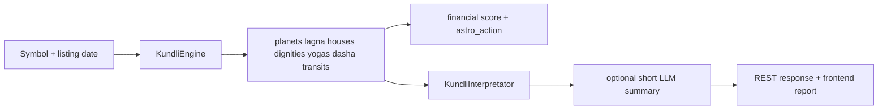

# VEDA-P000-04 Astrology Engine Audit

## Scope actually found in the repository

Astrology is implemented in **three separate active subsystems**:

| Surface | File(s) | Primary purpose | Runtime status |
| --- | --- | --- | --- |
| stock/country/human REST kundli | `engines/intelligence/kundli_engine.py`, `backend/routers/kundli.py` | finance-oriented kundli for stocks, countries, and a basic human endpoint | operational |
| personal-kundli chat toolchain | `engines/ai/chatbot/tools/kundli_calculator.py`, `kundli_interpreter.py`, `kundli_life_guide.py` | richer personal Jyotish reading returned through chat | operational |
| AstroFinance sector astrology | `engines/intelligence/astro_engine.py` | sector/day-level planetary signals for markets | operational |

Related but distinct:

- `engines/intelligence/gann_engine.py` for Gann calculations
- `engines/intelligence/kundli_interpretator.py` for finance-oriented stock/country interpretation

## Runtime evidence

Live runtime probes on 2026-08-10:

- `GET /api/stocks/RELIANCE/kundli` returned a complete chart with planets, dasha, yogas, transits, score, and interpretation
- `GET /api/kundli/country/India` returned a complete country chart
- `POST /api/kundli/human` returned a human chart
- `GET /api/kundli/bulk/status` reported `2053` generated stock kundli JSON files and `kundli_signals.csv`
- personal-kundli tool execution via `generate_personal_kundli()` returned a deterministic `formatted_report`

## Ephemeris audit

| Item | Observed implementation |
| --- | --- |
| Library | Swiss Ephemeris via `pyswisseph` |
| Verified runtime module | `swisseph` importable; reported version `20230604` |
| Secondary astronomy library | `ephem` also present and used in `astro_engine.py` |
| Sidereal mode | explicitly `swe.set_sid_mode(swe.SIDM_LAHIRI)` |
| Ayanamsha | Lahiri / Chitrapaksha |
| Node method | `Rahu = swe.TRUE_NODE`, `Ketu = Rahu + 180` in both main kundli paths |
| House handling | Swiss `houses(..., b'W')` call in stock engine plus downstream whole-sign house assignment from Lagna sign |
| Time handling | UTC conversion from local date/time; stock engine uses fixed timezone-offset map |
| Geographic coordinates | explicit lat/lon for exchanges, hardcoded country charts, city lookup/cache for personal chat tool |
| Geocentric/topocentric assumptions | geocentric implied by Swiss default usage; no topocentric override found |
| Ephemeris files | no separate ephemeris file path configuration identified in audited code |

### Ephemeris trust notes

Strong points:

- both main kundli paths use Swiss Ephemeris and Lahiri explicitly
- Rahu/Ketu logic is deterministic and visible

Weak points:

- stock engine timezone helper is a static mapping and appears non-DST-aware
- no formal cross-validation harness for astronomical correctness was found in tests

## Birth-chart foundation audit

| Capability | Evidence | Status |
| --- | --- | --- |
| date/time parsing | both stock and personal paths parse and normalize birth/inception data | COMPLETE |
| timezone handling | present in both paths; stock path uses fixed offset table, personal path uses numeric offset argument | PARTIAL |
| geographic coordinates | exchange registry, country registry, city lookup/cache, manual override | COMPLETE |
| UTC conversion | explicit | COMPLETE |
| Julian Day | explicit `_to_jd()` and `_jd_ut()` functions | COMPLETE |
| ayanamsha | explicit Lahiri | COMPLETE |
| sidereal zodiac | explicit | COMPLETE |
| ascendant / Lagna | explicit | COMPLETE |
| planetary longitudes | explicit | COMPLETE |
| Rashi | explicit | COMPLETE |
| whole-sign houses | explicit downstream assignment | COMPLETE |
| Bhava cusps | not surfaced as a separate feature; only Lagna/house sign mapping used downstream | PARTIAL |
| retrogression | explicit for major planets | COMPLETE |
| combustion | present in personal-kundli path; not surfaced in stock REST chart | PARTIAL |

## Graha intelligence audit

| Body | REST stock/country/human engine | Personal chat path | Notes |
| --- | --- | --- | --- |
| Sun | yes | yes | active |
| Moon | yes | yes | active |
| Mars | yes | yes | active |
| Mercury | yes | yes | active |
| Jupiter | yes | yes | active |
| Venus | yes | yes | active |
| Saturn | yes | yes | active |
| Rahu | yes | yes | true node |
| Ketu | yes | yes | derived opposite Rahu |
| Uranus | yes | no personal emphasis found | included in stock REST engine and AstroFinance |
| Neptune | yes | no personal emphasis found | included in stock REST engine and AstroFinance |
| Pluto | not found in active calculation paths | not found | absent |
| Upagrahas | not found | not found | absent |
| special Lagnas | not found | not found | absent |

## Rashi audit

Observed implementation style: mostly **hard-coded tables and deterministic code**, not database-driven and not LLM-generated.

| Capability | Evidence | Status |
| --- | --- | --- |
| sign placement | computed from sidereal longitude | COMPLETE |
| sign lordship | `SIGN_LORDS` / `SIGN_RULERS` tables | COMPLETE |
| exaltation | hard-coded table | COMPLETE |
| debilitation | hard-coded table | COMPLETE |
| Moolatrikona | hard-coded table | COMPLETE |
| own sign | hard-coded table | COMPLETE |
| friendly signs | via planet-friend tables and sign lord | COMPLETE |
| enemy signs | via enemy tables and sign lord | COMPLETE |
| neutral signs | default fallback | COMPLETE |

## Bhava audit

### Stock/finance REST engine

Implemented focus is narrow and finance-specific.

| Bhava capability | Evidence | Status |
| --- | --- | --- |
| 12 houses conceptually present | financial signification map has all 12 | IMPLEMENTED |
| finance-oriented house summaries | explicit for `2H, 5H, 8H, 10H, 11H` | COMPLETE |
| house lordship | computed | COMPLETE |
| occupants | computed | COMPLETE |
| strength labels | simple deterministic rules | PARTIAL |
| functional lordship | richer only in personal path | PARTIAL |
| Bhavat Bhavam | not found | ABSENT |
| Kendra / Trikona | used in yoga logic | PARTIAL |
| Dusthana / Upachaya / Maraka frameworks | partial references in personal path, not full systemic framework | PARTIAL |

### Personal chat path

`kundli_interpreter.py` and related helpers extend domain coverage:

- personality
- education
- career
- finance
- love/marriage
- children
- health
- home/family
- siblings
- father/fortune
- spirituality
- longevity
- current dasha period

## Aspect audit

### REST stock/country engine

| Capability | Evidence | Status |
| --- | --- | --- |
| special Vedic aspect tables | Mars 4/8, Jupiter 5/9, Saturn 3/10, Rahu/Ketu 5/9 defined | IMPLEMENTED |
| use of special aspect tables in final REST output | not prominently surfaced in REST payload | PARTIAL |
| transit aspect classification | angular classifier: conjunction, sextile, square, trine, opposition | COMPLETE but non-classical |
| house aspects | not separately surfaced | PARTIAL |
| sign aspects | not found | ABSENT |
| Jaimini aspects | not found | ABSENT |

### Personal chat path

`kundli_calculator.py` explicitly computes Vedic graha drishti and returns `planetary_aspects`.

Status:

- Graha Drishti: COMPLETE
- Sign/Jaimini aspects: ABSENT

## Planetary-strength audit

| Measure | Status | Evidence |
| --- | --- | --- |
| Shadbala | ABSENT | not found |
| Sthanabala | ABSENT | not found |
| Digbala | ABSENT | not found |
| Kalabala | ABSENT | not found |
| Cheshtabala | ABSENT | not found |
| Naisargikabala | ABSENT | not found |
| Drikbala | ABSENT | not found |
| Vargabala | ABSENT | not found |
| Ishta/Kashta | ABSENT | not found |
| dignity scoring | PARTIAL | dignity tables drive strength labels and scores |
| custom strength scoring | COMPLETE | finance-oriented score/action systems in stock and personal paths |

## Nakshatra audit

| Capability | REST stock engine | Personal chat path | Notes |
| --- | --- | --- | --- |
| 27 Nakshatras | yes | yes | complete list present |
| Pada | yes | yes | computed |
| planetary rulers | yes | yes | computed |
| deity | no | no | absent |
| Shakti | no | no | absent |
| Gana | no | no | absent |
| Yoni | only symbol text for Bharani etc., not structured compatibility field | no structured field | partial only in labels |
| Nadi | no | no | absent |
| behavioural interpretation | light in report text | some narrative usage | partial |
| compatibility | not found | not found | absent |
| dasha relationship | yes via Moon nakshatra -> Vimshottari | yes | complete |

## Varga / divisional-chart audit

### REST stock/country engine

| Varga | Calculation | Interpretation | Used in app | Tests | Status |
| --- | --- | --- | --- | --- | --- |
| D1 | yes | yes | yes | no direct tests | COMPLETE |
| D2 | yes | no clear interpretation surface | not evident in UI | no | PARTIAL |
| D3 | yes | no clear interpretation surface | not evident in UI | no | PARTIAL |
| D4 | yes | no clear interpretation surface | not evident in UI | no | PARTIAL |
| D7 | yes | no clear interpretation surface | not evident in UI | no | PARTIAL |
| D9 | yes | limited | not explicit in stock UI | no | PARTIAL |
| D10 | yes | limited | not explicit in stock UI | no | PARTIAL |
| D12 | yes | no clear interpretation surface | not evident | no | PARTIAL |
| D16 | yes | no clear interpretation surface | not evident | no | PARTIAL |
| D20 | yes | no clear interpretation surface | not evident | no | PARTIAL |
| D24 | no | no | no | no | ABSENT |
| D27 | no | no | no | no | ABSENT |
| D30 | yes | limited | not explicit | no | PARTIAL |
| D40 | no | no | no | no | ABSENT |
| D45 | no | no | no | no | ABSENT |
| D60 | yes | limited | not explicit | no | PARTIAL |

Note: REST engine also includes `D11`, which was not part of the requested minimum list.

### Personal chat path

| Varga | Calculation | Interpretation | Used in app | Tests | Status |
| --- | --- | --- | --- | --- | --- |
| D9 | yes | yes in formatted report | chat | no direct tests | COMPLETE |
| D10 | yes | yes in formatted report | chat | no direct tests | COMPLETE |
| others | no evidence in active result payload | no | no | no | ABSENT |

## Dasha audit

| Dasha family | Stock REST engine | Personal chat path | Status |
| --- | --- | --- | --- |
| Vimshottari | yes | yes | COMPLETE |
| Mahadasha | yes | yes | COMPLETE |
| Antardasha | yes | yes | COMPLETE |
| Pratyantardasha | yes | yes | COMPLETE |
| deeper subdivisions | no beyond Pratyantardasha in surfaced output | no | PARTIAL |
| Yogini | no | no | ABSENT |
| Ashtottari | no | no | ABSENT |
| Kalachakra | no | no | ABSENT |
| conditional dashas | no | no | ABSENT |

Interpretation distinction:

- stock REST path uses dasha in finance scoring and `KundliInterpretator`
- personal path uses dasha in formatted report and life-domain text

## Yoga audit

### Stock REST/finance path

Detected in code:

- Gaja Kesari
- Dhana Yoga
- Raja Yoga
- Viparita Raja
- Neecha Bhanga
- Kemdrum
- Kala Sarpa
- Parivartana
- Graha Yuddha and Mahabhagya are present in finance scoring map, but explicit detection evidence is weaker than the main set

Status:

- detection implemented: yes for core set
- conditions accurate: partially verified from code, not source-validated against classical references
- exceptions implemented: limited
- strength evaluated: limited/simple
- dasha activation considered: partial
- varga confirmation considered: absent
- classical source recorded: absent
- used in final interpretation: yes

### Personal chat path

Explicitly detected:

- Pancha Mahapurusha set:
  - Hamsa
  - Malavya
  - Bhadra
  - Ruchaka
  - Sasa
- Gaja Kesari
- Dhana Yoga
- Neecha Bhanga
- Kaal Sarp
- Kemadruma

## Dosha audit

### Personal chat path

Explicitly detected:

- Manglik / Kuja Dosha
- Shani Dosha
- Shani Dosha from Moon
- Surya Chandal
- Guru Chandal
- Shani-Chandra

### Stock REST path

- Kala Sarpa surfaced as a yoga-like detection
- no broad personal-dosha framework in REST payload

## Transit / Gochara audit

| Capability | Status | Notes |
| --- | --- | --- |
| current planetary transits | COMPLETE | present in stock engine and AstroFinance |
| natal-to-transit comparison | COMPLETE | stock engine compares current vs natal same-planet positions |
| Jupiter / Saturn / Rahu-Ketu transit handling | PARTIAL | used in scoring/interpreting, but limited logic |
| Moon transit emphasis | PARTIAL | present in AstroFinance and personal life guide context |
| Sade Sati | COMPLETE in personal life guide | explicit helper in `kundli_life_guide.py` |
| Ashtama Shani | PARTIAL | lighter Saturn-test detection exists in life guide, not full framework |
| transit aspects | PARTIAL | angular labels in stock engine, Vedic transit framework not broad |
| dasha + transit integration | PARTIAL | some integration in scoring and life guide, not systematic |
| transit timing | PARTIAL | present in guide/outlook style, not full predictive timing engine |

## Ashtakavarga audit

| Capability | Status |
| --- | --- |
| Bhinnashtakavarga | ABSENT |
| Sarvashtakavarga | ABSENT |
| Kakshya | ABSENT |
| transit scoring via Ashtakavarga | ABSENT |
| house scores via Ashtakavarga | ABSENT |

## Jaimini audit

| Capability | Status |
| --- | --- |
| Chara Karakas | ABSENT |
| Atmakaraka / Amatyakaraka / Darakaraka | ABSENT |
| Karakamsha | ABSENT |
| Arudha Lagna | ABSENT |
| Upapada | ABSENT |
| Rashi Drishti | ABSENT |
| Jaimini Dashas | ABSENT |

## Domain intelligence audit

### Personal Jyotish domains

| Domain | Evidence | Status |
| --- | --- | --- |
| marriage / love | `_read_love_marriage()` | FUNCTIONAL |
| finance / wealth | `_read_finance()` | FUNCTIONAL |
| career / profession | `_read_career()` | FUNCTIONAL |
| education | `_read_education()` | FUNCTIONAL |
| children | `_read_children()` | FUNCTIONAL |
| health | `_read_health()` | FUNCTIONAL |
| longevity | `_read_longevity()` | FUNCTIONAL |
| home / property / vehicles | `_read_home_family()` + house texts | PARTIAL |
| parents | father explicit, mother embedded in house texts | PARTIAL |
| siblings | `_read_siblings()` | FUNCTIONAL |
| spirituality | `_read_spirituality()` | FUNCTIONAL |
| remedies | Lal Kitab remedies in calculator | FUNCTIONAL |
| foreign travel / residence | indirect only via house narratives | PARTIAL |
| business | indirect through career/partnership readings | PARTIAL |
| litigation / inheritance | indirect house text only | PARTIAL |
| compatibility | not found | ABSENT |
| Muhurta | not found | ABSENT |

### Finance-oriented stock astrology domains

Implemented emphasis is narrower:

- wealth / profits
- speculation
- volatility
- management/reputation
- timing via dasha
- sector/day signals via AstroFinance

## Prediction pipeline audit

### Finance prediction for a stock

Classification: **hybrid deterministic system with optional LLM narrative**

### Career prediction for a person

Classification: **primarily deterministic code, not freeform LLM reasoning**

### Marriage prediction for a person

Same pipeline as above, with `_read_love_marriage()` as the main domain narrative function.

## Astrology conclusions

- the most credible existing astrology foundation is the Swiss-Ephemeris/Lahiri calculation core
- the strongest operational astrology asset is the cached stock-kundli corpus for `2053` symbols
- the personal-kundli chat path is richer than the REST path
- broad classical Jyotisha coverage is incomplete
- source provenance and classical validation are the biggest knowledge gaps
- future work should validate and preserve the existing deterministic core before attempting expansion
