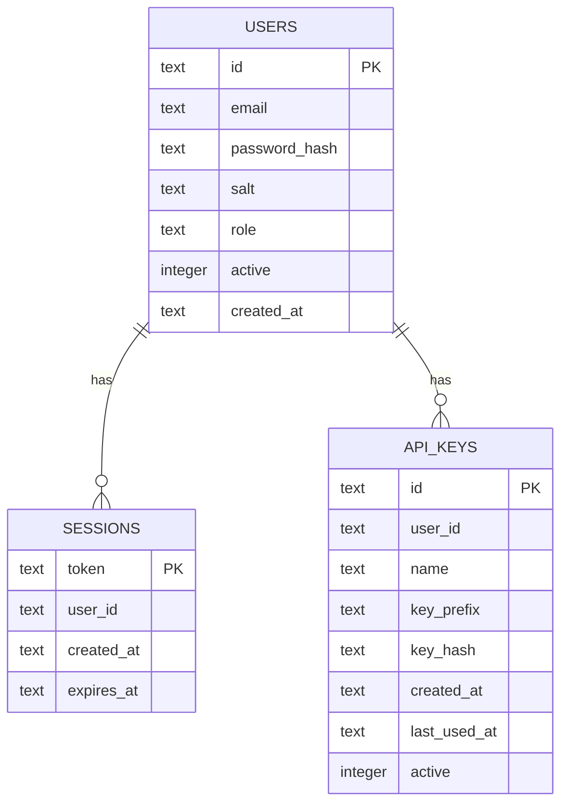

# VEDA-P000-06 Data, API, and Frontend Audit

## Data and persistence architecture

### High-level storage map

| Storage area | Role |
| --- | --- |
| `data/intelligence/` | derived intelligence CSV/JSON outputs used by runtime and RAG |
| `data/NSE/` | acquisition/reference/history/fundamentals/shareholding corp actions |
| `data/veda/` | chat sessions, uploads, reviewed knowledge, capability reviews, retrieval audits |
| `data/auth/users.db` | auth database |
| `data/portfolio/` | portfolio, broker sync, broker credentials |
| `logs/` | backend/frontend/process logs |

### Auth database ER diagram



Observed live table counts on 2026-08-10:

- `users`: `2`
- `sessions`: `2`
- `api_keys`: `1`

### Database conclusion

There is **no central market/astrology relational application database**.

The system is primarily:

- file-backed intelligence
- file-backed chat/retrieval state
- SQLite-backed auth

## API audit

### Live API inventory summary

OpenAPI runtime on 2026-08-10 reported `137` mounted endpoints.

Endpoint counts by tag:

| Tag | Count |
| --- | --- |
| auth | 14 |
| backtest | 4 |
| broker | 7 |
| charts | 4 |
| corporate | 10 |
| data_ops | 6 |
| execution | 11 |
| kundli | 7 |
| market | 4 |
| news | 1 |
| participant | 2 |
| pipeline | 5 |
| portfolio | 7 |
| research | 10 |
| risk | 8 |
| sectors | 5 |
| social_pulse | 1 |
| stocks | 9 |
| themes | 3 |
| voice | 4 |
| untagged | 15 |

### API design observations

- most APIs are REST-style JSON endpoints
- auth is middleware-based, not per-router custom auth logic
- the live OpenAPI schema is authoritative for mounted endpoints
- chat, health, and some root/auth routes are untagged in OpenAPI

### Selected endpoint inventory by domain

#### Auth

```text
GET    /api/auth/config
PUT    /api/auth/config
POST   /api/auth/setup
POST   /api/auth/login
POST   /api/auth/logout
GET    /api/auth/me
PUT    /api/auth/me/password
GET    /api/auth/users
POST   /api/auth/users
PUT    /api/auth/users/{user_id}
DELETE /api/auth/users/{user_id}
GET    /api/auth/api-keys
POST   /api/auth/api-keys
DELETE /api/auth/api-keys/{key_id}
```

#### Market / sectors / stocks

```text
GET /api/market/regime
GET /api/market/context
GET /api/market/indices
GET /api/market/freshness

GET /api/sectors
GET /api/sectors/fpi
GET /api/sectors/history
GET /api/sectors/{sector}
GET /api/sectors/{sector}/fpi-history

GET /api/stocks
GET /api/stocks/watchlist
GET /api/stocks/{symbol}
GET /api/stocks/{symbol}/momentum
GET /api/stocks/{symbol}/report
GET /api/stocks/{symbol}/announcements
GET /api/stocks/{symbol}/corporate-actions
GET /api/stocks/announcement-summary
GET /api/stocks/news-article-summary
```

#### Corporate / news / themes

```text
GET /api/corporate/deals
GET /api/corporate/deal-tape
GET /api/corporate/events
GET /api/corporate/catalysts
GET /api/corporate/upcoming-actions
GET /api/corporate/confidence
GET /api/corporate/summary
GET /api/corporate/announcements
GET /api/corporate/announcements/{symbol}
GET /api/corporate/announcement-signals

GET /api/news

GET /api/themes
GET /api/themes/{theme_code}
GET /api/themes/{theme_code}/stocks
```

#### Chat / research / retrieval

```text
POST   /api/chat
GET    /api/chat/capabilities
POST   /api/chat/attachments
GET    /api/chat/sessions
PUT    /api/chat/sessions/{session_id}
DELETE /api/chat/sessions
DELETE /api/chat/sessions/{session_id}
DELETE /api/chat/session/{session_id}
POST   /api/chat/knowledge/draft
POST   /api/chat/knowledge/draft/{draft_id}/approve
DELETE /api/chat/knowledge/draft/{draft_id}
POST   /api/chat/capabilities/repo/draft
POST   /api/chat/capabilities/repo/draft/{draft_id}/approve

GET    /api/research/compare
GET    /api/research/conviction
POST   /api/research/conviction/refresh
GET    /api/research/efficacy
POST   /api/research/screen
GET    /api/research/universe/stats
GET    /api/research/notes
GET    /api/research/notes/{symbol}
PUT    /api/research/notes/{symbol}
DELETE /api/research/notes/{symbol}
```

#### Kundli / astrology

```text
GET  /api/stocks/{symbol}/kundli
POST /api/kundli/human
GET  /api/kundli/country/{name}
GET  /api/kundli/gann/{symbol}
GET  /api/kundli/gann/market/planetary-lines
GET  /api/kundli/bulk/status
POST /api/kundli/bulk/run
```

#### Portfolio / broker / execution / risk / pipeline / data ops

```text
GET    /api/portfolio
POST   /api/portfolio/buy
POST   /api/portfolio/sell
POST   /api/portfolio/import
GET    /api/portfolio/import/template
GET    /api/portfolio/transactions
DELETE /api/portfolio/positions/{symbol}

GET    /api/broker/status
POST   /api/broker/auth
DELETE /api/broker/auth
GET    /api/broker/holdings
POST   /api/broker/import-csv
POST   /api/broker/sync
POST   /api/broker/sync-trades

GET    /api/execution/config
PUT    /api/execution/config
POST   /api/execution/order
DELETE /api/execution/order/{order_id}
GET    /api/execution/order/{order_id}
GET    /api/execution/orders
POST   /api/execution/recommend
POST   /api/execution/security-master/refresh
GET    /api/execution/slice_plan
GET    /api/execution/tca
POST   /api/execution/tca/refresh

GET    /api/risk/factors
POST   /api/risk/factors/refresh
GET    /api/risk/portfolio
POST   /api/risk/refresh
GET    /api/risk/simulate
POST   /api/risk/simulate
GET    /api/risk/stress
POST   /api/risk/stress/refresh

GET  /api/pipeline/status
GET  /api/pipeline/log
GET  /api/pipeline/next
POST /api/pipeline/run
POST /api/pipeline/stop

GET  /api/data/status
GET  /api/data/engines
GET  /api/data/run/{engine_name}
POST /api/data/kill
GET  /api/data/running
GET  /api/data/backup/status
```

#### Voice / websocket / health

```text
POST /api/voice/tts
GET  /api/voice/voices
POST /api/voice/log
GET  /api/voice/analytics

WS   /ws/live
GET  /
GET  /health
GET  /openapi.json
```

### API status notes

- auth live config returned `{"enabled": false, "token_expiry_days": 7}`
- `/api/auth/me` returned `{"enabled": false, "user": null}`
- because auth is off, many operational endpoints are effectively open in the local runtime

## Frontend audit

### Framework and routing

Frontend stack:

- React 19
- React Router 7
- React Query
- Vite 8
- TypeScript 6
- Zustand

Observed route inventory:

```text
/fullchart/:symbol
/
/sectors
/sectors/:sector
/watchlist
/stocks/:symbol
/participant
/corporate
/chat
/settings
/stocks
/charts
/data
/portfolio
/backtest
/broker
/research
/execution
/login
/admin
/themes
/report/:symbol
/report
```

### Route-to-backend mapping

| Route | Primary screen | Main backend dependency | Status |
| --- | --- | --- | --- |
| `/` | dashboard | market/participant/sectors/stocks | operational |
| `/sectors` | sectors page | `/api/sectors*` | operational |
| `/sectors/:sector` | sector detail | `/api/sectors/{sector}` | operational |
| `/watchlist` | watchlist | `/api/stocks/watchlist` and related stock feeds | operational |
| `/stocks/:symbol` | stock detail | `/api/stocks/{symbol}` + corporate/charts | operational |
| `/report/:symbol` | report page | `/api/stocks/{symbol}/kundli`, `/api/charts/ohlcv`, stock detail | operational |
| `/chat` | VEDA chat | `/api/chat*` | operational |
| `/data` | data control | `/api/data*`, `/api/pipeline*` | operational |
| `/portfolio` | portfolio | `/api/portfolio*` | operational |
| `/backtest` | backtest | `/api/backtest*` | operational |
| `/broker` | broker | `/api/broker*` | operational |
| `/research` | research | `/api/research*` | operational |
| `/execution` | execution | `/api/execution*` | operational |
| `/admin` | admin/auth | `/api/auth*` | operational |
| `/themes` | themes | `/api/themes*` | operational |
| `/participant` | redirect | none, redirects to `/` | disconnected |
| `/report` | generic report shell | symbol-driven stock report flow | partial |

### UI elements without strong backend completion evidence

| Surface | Observation |
| --- | --- |
| dedicated personal-kundli form/page | not found |
| participant route | redirects to root |
| some settings/admin presentation | operational UI exists, but runtime auth is disabled, so governance assumptions differ from UI framing |

## Data/API/frontend conclusions

- the API surface is broad and live
- the frontend is connected to far more than astrology
- the data layer is heavily file-backed and central to runtime behaviour
- the stock-report/kundli frontend is a real, integrated operational surface
- personal Jyotish is primarily a chat workflow, not a dedicated frontend module
