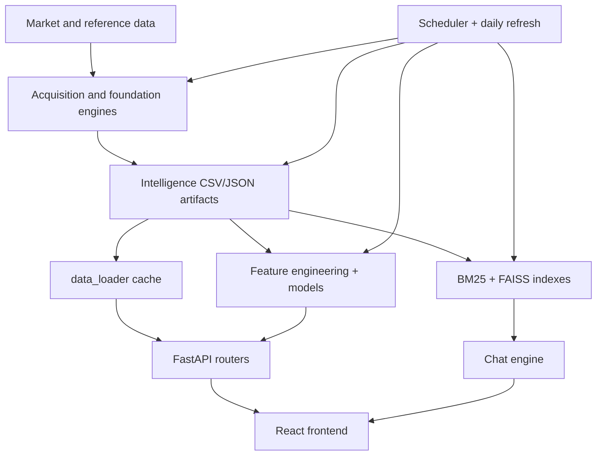
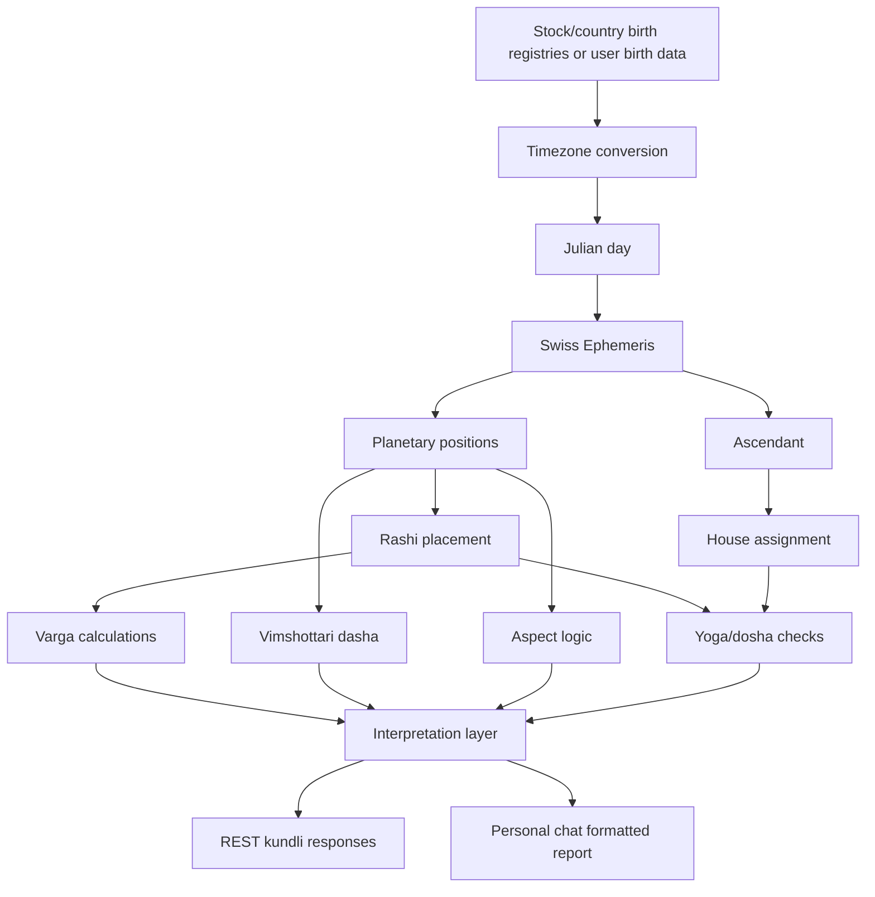

# VEDA-P000-09 Preservation and Risk Matrix

## Preservation matrix

| Component | Why Preserve | Dependencies | Risk if Rewritten | Recommendation |
| --- | --- | --- | --- | --- |
| Swiss-Ephemeris calculation core in `kundli_engine.py` and reused helpers | this is the strongest deterministic astrology foundation currently in the repo | `swisseph`, timezone conversion logic, stock/country registries, REST/chat callers | silent chart drift, broken bulk corpus compatibility, changed downstream scores | preserve and validate with golden fixtures before any redesign |
| cached stock kundli corpus under `data/intelligence/kundli/` and bulk status pipeline | large precomputed asset already used by runtime | stock inception registry, kundli engine, API/router consumers | expensive regeneration, behavioural drift, report regression | preserve as baseline evidence and snapshot reference |
| personal-kundli chat report pipeline | currently the richest personal astrology surface | chat intent routing, tool wrappers, calculator, interpreter, life guide | loss of working personal-report behaviour and prompt bypass semantics | preserve behaviour first, then isolate and test |
| `backend/services/data_loader.py` + file-backed intelligence store | central runtime spine for the broader platform | `data/intelligence/*`, most routers, scheduler refresh outputs | widespread API breakage and stale runtime data | preserve and add contract tests before change |
| unified retrieval + reviewed knowledge workflow | already operational and reusable for future governed research | reviewed memory files, BM25/FAISS indexes, chat engine, approval endpoints | losing the best existing research substrate in the repo | preserve and extend rather than replace |
| scheduler + daily refresh orchestration | ties together the active platform outputs | APScheduler, subprocess stages, output files, alerts | data freshness regression, inconsistent daily state | preserve sequencing; validate stage contracts before edits |
| frontend report, chat, and admin shells | already wired to live backend capabilities | route map, auth mode, endpoint contracts | user-visible breakage across high-value surfaces | preserve route/API contracts and snapshot key pages |
| auth SQLite store and middleware | only central relational store currently in use | `users.db`, auth middleware, setup/bootstrap flow | login/admin regressions and session breakage | preserve schema/runtime, then govern config and defaults |

## Change-risk map

Color scale:

- `GREEN` low-risk isolated change
- `AMBER` interconnected change
- `RED` foundational/high-risk change
- `BLACK` insufficient evidence

| Module / Surface | Risk | Reason |
| --- | --- | --- |
| `backend/main.py` | RED | startup side effects, router mounting, auth, scheduler, voice validation |
| `backend/services/data_loader.py` | RED | many APIs depend on its in-memory dataset contracts |
| `engines/orchestration/refresh_scheduler.py` | RED | background job activation affects platform freshness |
| `engines/orchestration/daily_refresh.py` | RED | subprocess pipeline writes core intelligence artifacts |
| `engines/intelligence/kundli_engine.py` | RED | authoritative stock/country/human REST astrology calculation path |
| `engines/ai/chatbot/tools/kundli_calculator.py` | RED | richer personal-kundli path with distinct rules and outputs |
| `engines/ai/chatbot/chat_engine.py` | AMBER | operationally central and current test drift is concentrated here |
| `engines/ai/knowledge/*` | AMBER | retrieval works, but index rebuilds and schema changes can affect chat quality broadly |
| `backend/routers/kundli.py` | AMBER | connects UI/runtime to astrology engines and bulk generation |
| `backend/auth/*` | AMBER | security-sensitive, but relatively isolated compared with data loader and scheduler |
| `engines/broker/*` | AMBER | security-sensitive credential handling plus external dependency |
| `frontend/src/pages/ReportPage.tsx` | AMBER | user-visible astrology integration surface |
| `frontend/src/pages/ChatPage.tsx` | AMBER | user-visible research and kundli interaction surface |
| `frontend/src/pages/*.tsx` outside report/chat/admin | GREEN | mostly route-local UI so long as API contracts hold |
| `docs/current-state/*` | GREEN | audit-only documentation layer |
| astrology source provenance layer | BLACK | not yet implemented, so future design must be validated carefully |

## Dependency map

### Platform dependency graph



### Astrology dependency graph



### Practical dependency interpretation

- timezone conversion is upstream of everything; this is why the fixed-offset map in the stock path is a foundational risk
- any change to planetary positions, Lagna, or sign assignment propagates into Vargas, Yogas, Dashas, scores, and narratives
- personal kundli and REST kundli are not just different UIs; they are different dependency branches with overlapping but not identical logic

## Preservation-first policy

The evidence supports:

```text
PRESERVE -> VALIDATE -> EXTEND
```

The evidence does not support:

```text
REWRITE -> MIGRATE -> REPLACE
```

Reason:

- too much live behaviour already depends on current file formats, cached artifacts, route contracts, and duplicated astrology logic
- the repo already contains reusable working subsystems; replacing them without fixtures would create avoidable regression risk

## Preservation conclusion

The most valuable working assets are not the planning docs. They are:

- the deterministic ephemeris-backed calculation paths
- the cached kundli corpus
- the file-based market-intelligence runtime
- the reviewed retrieval workflow
- the live frontend/backend contracts

These should be frozen with tests and snapshots before any foundation work proceeds.
