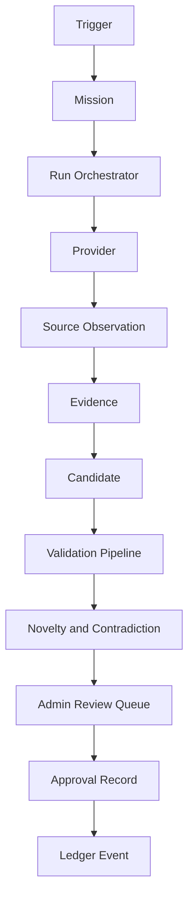

# VEDA-P006 Research Platform Architecture

Date baseline: `2026-08-10`

## Core Layout

- contracts: `engines/ai/research/platform/contracts.py`
- orchestration service: `engines/ai/research/platform/service.py`
- persistence: `engines/ai/research/platform/store.py`
- provider boundary: `engines/ai/research/platform/providers.py`
- security boundary: `engines/ai/research/platform/security.py`
- domain adapter: `engines/ai/research/platform/synthetic.py`
- snapshot validation: `engines/ai/research/platform/validation.py`
- admin API surface: `backend/routers/research.py`

## Three-Zone Knowledge Boundary

- `APPROVED_CORE`
  - approved, governed comparison targets only
  - used by novelty and contradiction checks
- `RESEARCH_CANDIDATE`
  - discovered but not authoritative
  - reviewable and comparable
- `RESEARCH_ARCHIVE`
  - rejected, archived, or superseded artifacts remain searchable

## Layered Flow

## Durable Runtime Boundary

- persistence target: `data/research/runtime/research_platform.sqlite3`
- tracked exports: `data/research/synthetic_pilot/*.json`
- schema exports: `schemas/research/*.schema.json`
- runtime SQLite is ignored by Git; tracked pilot exports are committed evidence

## Internal Administrative APIs

- `GET /api/research/dashboard`
- `GET /api/research/platform/health`
- `GET /api/research/domains`
- `GET /api/research/missions`
- `POST /api/research/missions`
- `GET /api/research/missions/{mission_id}`
- `POST /api/research/missions/{mission_id}/pause`
- `POST /api/research/missions/{mission_id}/resume`
- `POST /api/research/missions/{mission_id}/trigger`
- `GET /api/research/runs`
- `GET /api/research/runs/{run_id}`
- `GET /api/research/candidates`
- `GET /api/research/candidates/{candidate_id}`
- `POST /api/research/candidates/{candidate_id}/decision`
- `GET /api/research/ledger`
- `GET /api/research/schedules`
- `POST /api/research/schedules`
- `PUT /api/research/schedules/{schedule_id}`

These routes are tagged `research-admin` and protected with `require_admin`. They are excluded from the frozen P001 public contract baseline by `scripts/generate_p001_api_baseline.py`.
